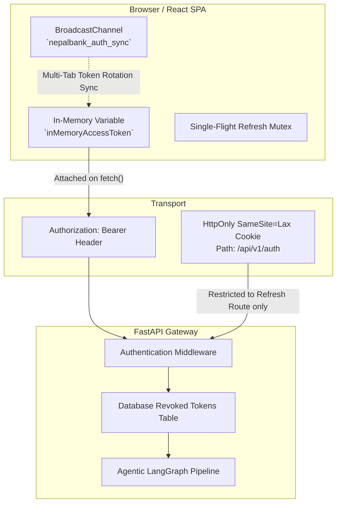

# 🛡️ Enterprise Banking Security & Threat Model

This document outlines the architecture, threat models, countermeasures, and cryptographic specifications implemented in **NepalBank AI** (compliant with Nepal Rastra Bank guidelines and OWASP Top 10 standards).

---

## 1. Authentication & Token Lifecycle Architecture

### 🔑 The Dual Token Model (In-Memory Access Token + Path-Isolated Refresh Cookie)

---

## 2. In-Memory vs. Cookie Token Vulnerabilities & Engineering Fixes

| Vulnerability / Edge Case | Root Cause | Implemented Solution in this Codebase |
| :--- | :--- | :--- |
| **1. Page Reload Delay / Flash** | JS memory is cleared on `F5` / reload. | **Initial Mount Silent Refresh Guard**: App renders a clean loading state (`isLoadingAuth=true`) and calls `POST /api/v1/auth/refresh` on startup. The login screen never flashes. |
| **2. Concurrency Race Conditions** | Parallel requests firing during token expiration all trigger duplicate refresh calls. | **Single-Flight Refresh Mutex (`getFreshAccessToken`)**: All concurrent 401 callers queue behind a single shared promise. Only 1 request is sent to `/auth/refresh`, and all callers retry simultaneously with the new token. |
| **3. Cross-Site Request Forgery (CSRF)** | Ambient browser cookies sent automatically on cross-site form submissions. | **Zero Ambient Access Token**: General API routes (`/chat`, `/sessions`, etc.) accept **only** `Authorization: Bearer <token>` headers. Cross-site HTML forms cannot forge or set custom headers. |
| **4. Multi-Tab Desynchronization** | Tab A rotates the refresh token, causing Tab B's in-memory token to become stale. | **Cross-Tab Synchronization (`BroadcastChannel`)**: Web Workers and open browser tabs communicate via `nepalbank_auth_sync`. When any tab rotates the token or logs out, all open tabs immediately synchronize their in-memory state. |
| **5. Token Theft via XSS** | Scripts stealing credentials from `localStorage` or `sessionStorage`. | **No Web Storage Persistence**: Tokens are never placed in `localStorage`. They evaporate the moment the browser tab is closed. |

---

## 3. Threat Mitigation Matrix

### 3.1 CSRF (Cross-Site Request Forgery)
- **Status**: **Fully Mitigated**.
- **Mechanisms**:
  1. Access token is in-memory and passed strictly via `Authorization: Bearer`.
  2. The `refresh_token` cookie is scoped exclusively to `path=/api/v1/auth` with `SameSite=Lax` and `HttpOnly=True`.
  3. API CORS middleware enforces an explicit origin whitelist ([`cors_allowed_origins`](src/banking_chat/core/config/settings.py)).

### 3.2 Token Replay & Revocation
- **Status**: **Fully Mitigated**.
- **Mechanisms**:
  1. On logout, the SHA-256 hash of active tokens is written to the PostgreSQL / SQLite database `revoked_tokens` table.
  2. Every authentication step validates against the token blacklist before processing.

### 3.3 Outbound PII Leakage
- **Status**: **Fully Mitigated**.
- **Mechanisms**:
  1. [`PIIRedactor`](src/banking_chat/modules/pii_guard/redactor.py) inspects all incoming prompts for Nepali Citizenship numbers, National ID (NID), 16-digit account numbers, and phone numbers.
  2. Reversible cryptographic hashes replace PII before outbound LLM transit and are restored upon response detokenization.

---

## 4. Operational Guidelines

1. **Production HTTPS**: In production, ensure `secure=True` on cookies when TLS termination occurs at Nginx.
2. **Rotating Secrets**: Maintain `APP_SECRET_KEY` and IdP signing keys via environment variables or cloud secret managers (AWS Secrets Manager / Vault).
3. **Database Audit Trails**: Query `revoked_tokens` and `chat_sessions` to verify customer authentication history and regulatory audit compliance.
